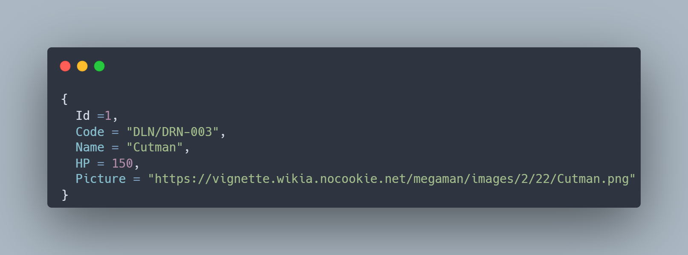

<h1 align="center">
  <br />
  
  <br />
  <b>Mega Man Robots API</b>
  <br />
  <sub
    ><sup><b>(MEGA-MAN-ROBOTS)</b></sup></sub
  >
  <br />
  <a
    href="https://github.com/Escarletx/MegaApiDotnetCore/actions/workflows/build.yml"
  >
    
  </a>
  <a href="https://github.com/Escarletx/MegaApiDotnetCore/releases/latest">
    
  </a>
</h1>

<p align="center">
  Este projeto foi criado para listar dados de bosses de Megaman através de uma API desenvolvida em .NET Core 3.1. O objetivo principal é fornecer um backend que disponibiliza dados no formato JSON.
  <br />

</p>

<p align="center">
  Desenvolvido com Entity Framework Core e outras tecnologias modernas do .NET, este projeto tem como objetivo fornecer uma API robusta para acessar dados dos robôs de Mega Man.
  <br />
</p>

<p align="center">
  <br />
  
</p>

## API Endpoints

<table align="center">
  <tr>
    <th>Method</th>
    <th>Endpoint</th>
    <th>Description</th>
  </tr>
  <tr>
    <td>GET</td>
    <td>/api/v1/robots</td>
    <td>Retorna uma lista de todos os robôs.</td>
  </tr>
  <tr>
    <td>GET</td>
    <td>/api/v1/robots/{id}</td>
    <td>Retorna os detalhes de um robô específico por ID</td>
  </tr>
  <tr>
    <td>POST</td>
    <td>/api/v1/robots</td>
    <td>Endpoint para criar um novo registro de robô</td>
  </tr>
</table>

## Tecnologias utilizadas

<p align="center">
  - <b>Entity Framework Core:</b> ORM para gerenciamento de dados.<br />
  - <b>Design de API RESTful:</b> Garante a comunicação clara e eficais entre os endpoints<br />
  - <b>Injeção de dependências:</b> Utilizada em todo o projeto para promover baixo acoplamento e maior testabilidade<br />
</p>

## Dependências

<table align="center">
  <tr>
    <th>Pacote</th>
    <th>Versção</th>
    <th>Link</th>
  </tr>
  <tr>
    <td>Microsoft.EntityFrameworkCore</td>
    <td>3.1.8</td>
    <td>
      <a
        href="https://www.nuget.org/packages/Microsoft.EntityFrameworkCore/3.1.8"
        >NuGet</a
      >
    </td>
  </tr>
  <tr>
    <td>Microsoft.EntityFrameworkCore.Design</td>
    <td>3.1.8</td>
    <td>
      <a
        href="https://www.nuget.org/packages/Microsoft.EntityFrameworkCore.Design/3.1.8"
        >NuGet</a
      >
    </td>
  </tr>
  <tr>
    <td>Microsoft.EntityFrameworkCore.SqlServer</td>
    <td>3.1.8</td>
    <td>
      <a
        href="https://www.nuget.org/packages/Microsoft.EntityFrameworkCore.SqlServer/3.1.8"
        >NuGet</a
      >
    </td>
  </tr>
  <tr>
    <td>Newtonsoft.Json</td>
    <td>12.0.2</td>
    <td>
      <a href="https://www.nuget.org/packages/Newtonsoft.Json/12.0.2">NuGet</a>
    </td>
  </tr>
</table>

## :gear: Arch

```🌐
src
├── 📂 Controllers      [Rota para os endpoints]
├── 📂 Models           [Modelos de banco de dados]
├── 📂 Services         [Regras de negócio]
├── 📂 Middlewares      [Funções intermediárias entre a requisição HTTP e a resposta final do servidor]
├── 📂 Database         [Estruturas relacionadas ao banco de dados]
│   ├── 📂 DTOs             [Modelos de Entrada e Modelos de Visualização (Objetos de Transferência de Dados)]
│   ├── 📂 EntityFramework  [Arquivos relacionados ao ORM Entity Framework]
│   │     ├── 📂 Context         [Configurações do contexto da entidade]
│   │     ├── 📂 Migrations      [Migrações para atualizações do banco de dados]
│   ├── 📂 Repositories     [Padrão de repositório]
```

## Este software é licenciado sob os termos da [MIT].
